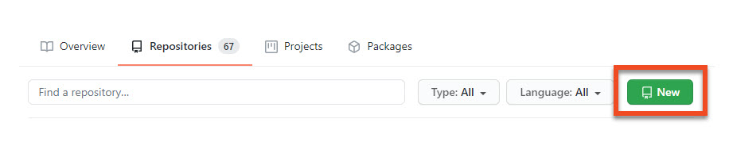
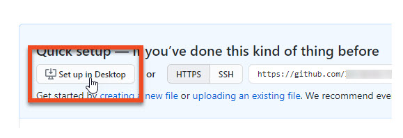
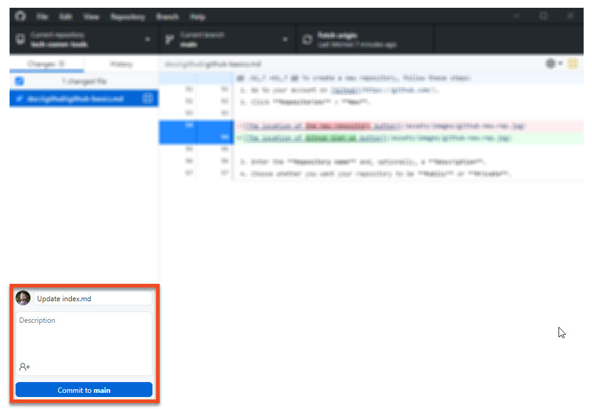
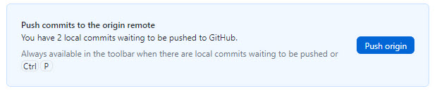

Getting started with GitHub
===========================

To start working with GitHub, you first need to [set up your GitHub account](#setting-up-a-github-account). With [GitHub Desktop](#installing-github-desktop), you can easily manage your repositories on your computer.

## Setting up a GitHub account

To set up a new GitHub account, follow these steps:

1. Go to the [GitHub website](https://github.com).
2. In the upper right-hand corner, click **Sign up**.  
    
   
3. Enter your **Username**, **Email address**, and **Password**.
4. Under **Verify your account**, solve a puzzle to confirm you are not a robot.
5. Click **Create account**.
6. Check your inbox. In an email from GitHub, click **Verify email address** to complete your registration.

## Installing GitHub Desktop

To install GitHub Desktop on your computer, do the following:

1. Go to the [Github Desktop download page](https://desktop.github.com/).
2. Download an installation file appropriate for your operating system.
3. Once downloaded, execute the file and follow the instructions displayed in the setup assistant.

## Creating a repository

To create a new repository, follow these steps:

1. Open a browser and go to your GitHub account.
2. Click **Repositories** > **New**.
  
3. Enter the **Repository name** and, optionally, a **Description**.
4. Choose whether you want your repository to be **Public** or **Private**.
  
5. Click **Create repository**.
6. To manage your repository from GitHub Desktop, click **Set up in Desktop**.
   
7. In GitHub Desktop, enter **Local path** and click **Clone**.

## Working with your repository in GitHub Desktop

To update your online repository once you have edited it locally, follow these steps:

1. In GitHub Desktop, enter the name for your changes and an optional description.
2. Click **Commit to *branchname***, where *branchname* is the name of the current branch, for instance *main*.
  
3. Click **Push origin**.  
  
