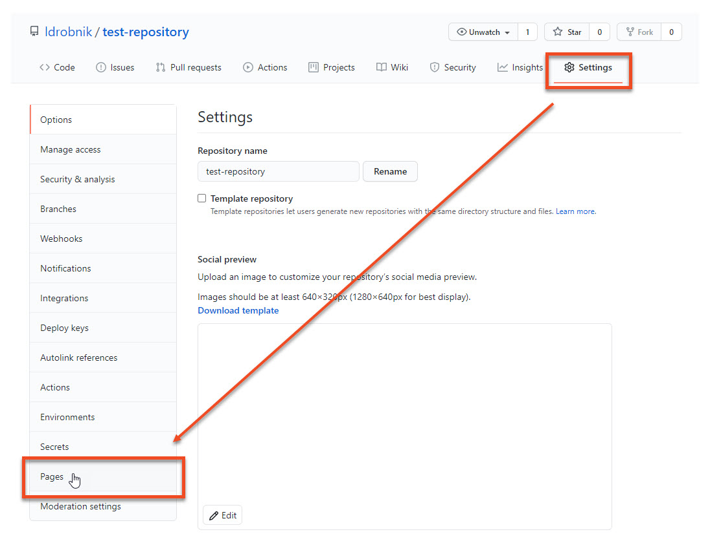
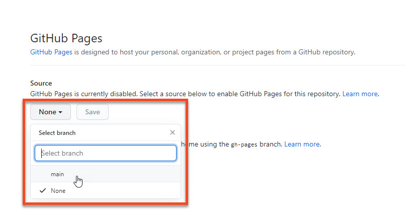
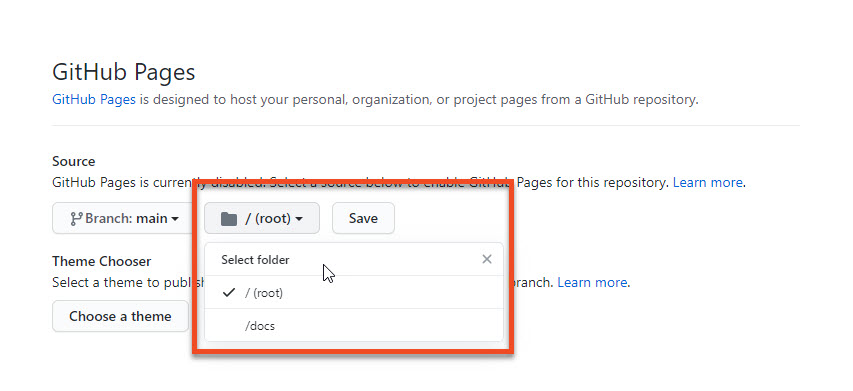

Publishing on GitHub Pages
================================================

GitHub Pages is a free hosting service that lets you publish a website from a GitHub repository.

## Publishing a website associated with your GitHub account

1. Open a browser and go to your GitHub account.
2. Create a new public repository named ***username*.github.io**, where *username* is your GitHub username.
    
3. To clone your repository on your computer, click **Set up in Desktop**.
4. Create Markdown or HTML files in your local repository.  
    **Note:** One file has to be named either *index.md* or *index.html*. This will be the home page of your website.
5. In Github Desktop, commit and push your changes.
6. To access your website, open a browser and go to **https://*username*.github.io**.

## Publishing a repository on GitHub Pages

1. Open your repository and go to **Settings > Pages**.  
    
2. Under **Source**, click the drop-down menu to select a branch that you want to use, for example *main*.  
   
3. Select a folder that contains your website files and click **Save**.  
   
4. Your website is published under **https://*username*.github.io/*repository*/**, where *username* is your GitHub username and *repository* is your repository name.

## Customizing your website

If you want to customize the appearance of your website, you can use a [Jekyll theme](https://jekyll-themes.com/), such as [Just the Docs](https://github.com/pmarsceill/just-the-docs).