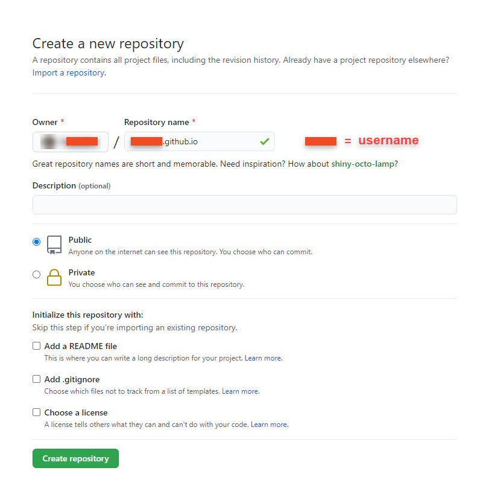

Publishing your documentation using GitHub Pages
================================================

GitHub Pages is a free hosting service that lets you [publish a website](#generating-a-static-website-using-github-pages) from a GitHub repository.

----------------------

<h2 class="text-delta">Table of contents</h2>

- [Publishing your documentation using GitHub Pages](#publishing-your-documentation-using-github-pages)
  - [Generating a static website using GitHub Pages](#generating-a-static-website-using-github-pages)
  - [Customizing your website](#customizing-your-website)

----------------------

## Generating a static website using GitHub Pages

1. Open a browser and go to your GitHub account.
2. Create a new public repository named ***username*.github.io**, where *username* is your GitHub username.
    
3. To clone your repository on your computer, click **Set up in Desktop**.
4. Create Markdown or HTML files in your local repository.  
    **Note:** One file has to be named either *index.md* or *index.html*. This will be the home page of your website.
5. In Github Desktop, commit and push your changes.
6. To access your website, open a browser and go to **https://*username*.github.io**.

## Customizing your website

If you want to customize the appearance of your website, you can use a [Jekyll theme](https://jekyll-themes.com/), such as [Just the Docs](https://github.com/pmarsceill/just-the-docs).