GitHub and teamwork
===================

GitHub makes collaboration easy. You can [invite other users to work on your project](#sharing-your-repository-with-other-users) or [contribute to their repositories](#contributing-to-another-users-repository).

## Adding a branch protection rule

If you don't want others to be able to update your main branch without your approval, you need to set up a branch protection rule. To do so, follow these steps:

1. Go to your repository page on GitHub.
2. Click **Settings**.
  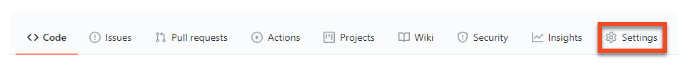
4. In the menu on the left, click **Branches**.
5. Next to **Branch protection** rules, click **Add rule**.
6. Under **Branch name pattern**, enter the name of the branch you want to protect, for instance *main*.
7. Under **Protect matching branches**, tick **Require pull request reviews before merging**.
   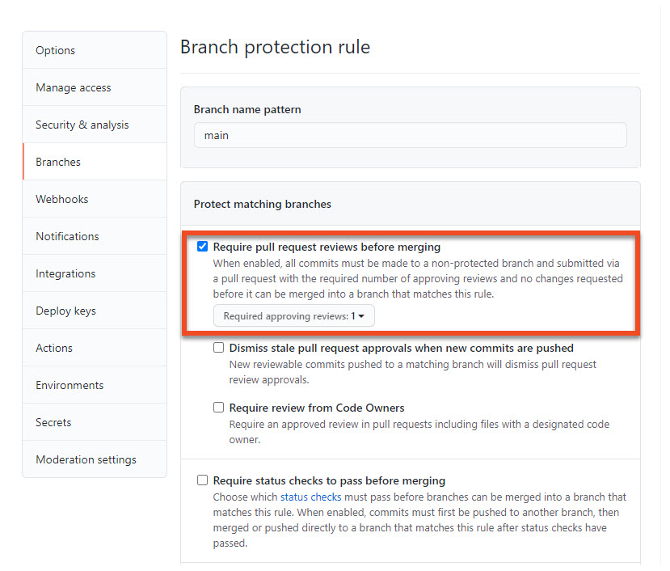
8. Scroll down and click **Create**.

## Sharing your repository with other users

If you want to let other GitHub users contribute to your repository, follow these steps:

1. Go to your repository page on GitHub and click **Settings**.
2. In the menu on the left, click **Manage access**.
3. To add a contributor, click **Invite a collaborator**.
  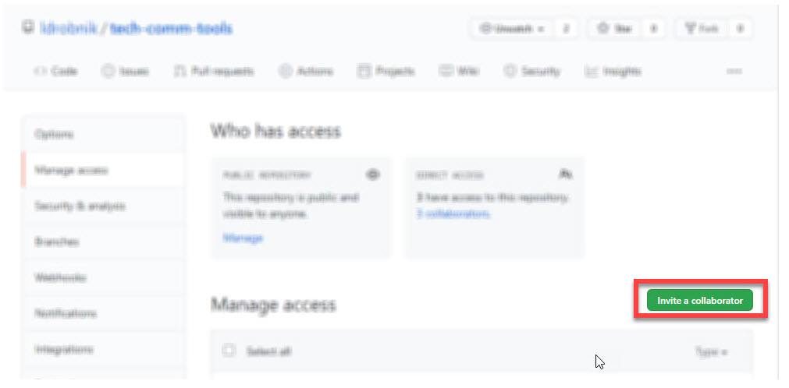
4. Search the user you want to work with by their username, full name, or email and click **Select a collaborator above**.

## Contributing to another user's repository

If another GitHub user has shared their repository with you, and you want to contribute your work, do the following:

1. In the invitation email from GitHub, click **View invitation**.
2. Click **Accept invitation**.  
  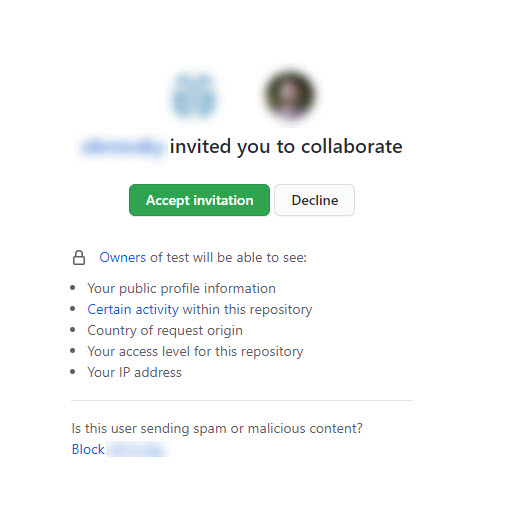  
3. To clone the repository on your computer, click **Code > Open with GitHub Desktop**.
  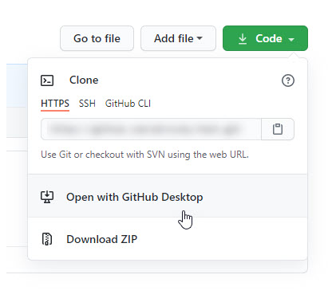
4. In GitHub Desktop, enter **Local path** and click **Clone**.
5. Create a new branch by clicking **Current branch > New branch**.
6. Enter the name of your branch and click **Create branch**.
7. Once you have made your changes, commit them and click **Publish branch**.
   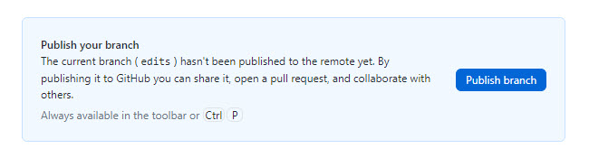
8. To propose your changes to the repository owner, click **Create Pull Request**.
  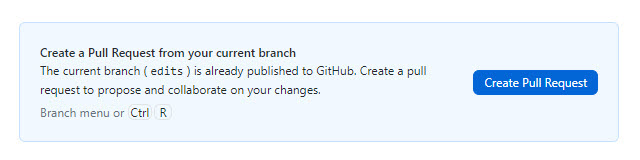
9. On the GitHub page that opens, write any message to the repository owner and click **Create pull request**.
  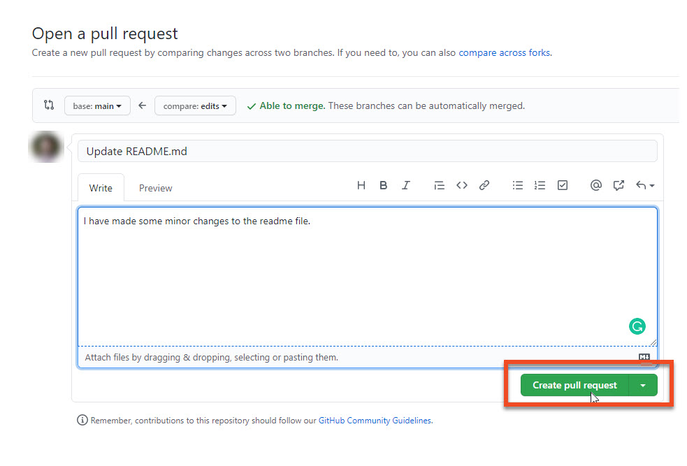

## Reviewing contributor changes

To accept or decline changes made by a contributor, follow these instructions:

1. Go to your repository page on GitHub and click **Pull requests**.
  
2. Click a pull request created by a contributor.
3. To review the changes, click **Add your review**.
  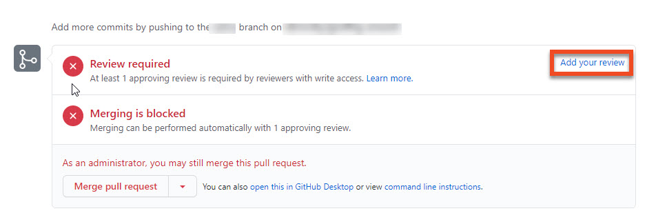
4. Click **Review changes**, write any message to the contributor and tick one of the following options:
  - **Comment** to submit feedback without approval.
  - **Approve** to submit feedback and approve merging of the changes.
  - **Request changes** to submit feedback that the contributor must address before merging.
  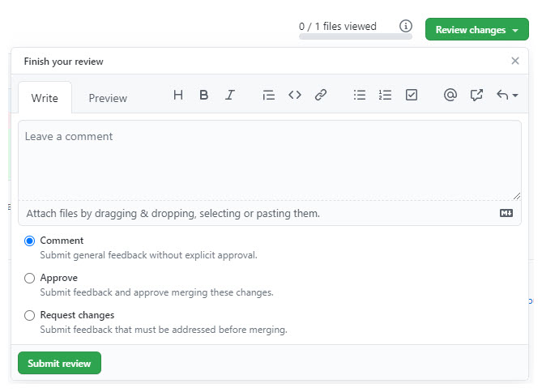
5. Click **Submit review**.
6. To merge any approved changes with your main branch, click **Merge pull request**.
  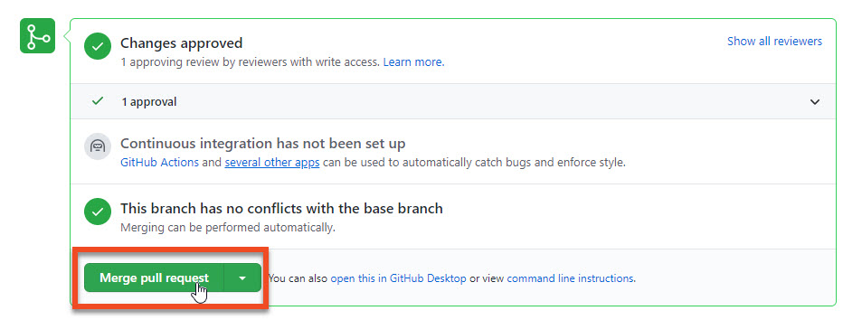
7. Click **Confirm merge**.
8. You can delete the contributor's branch by clicking **Delete branch**.

## Resolving conflicts

When multiple people work on the same files, they can introduce conflicting changes. To resolve conflicts introduced by a contributor, follow these steps:

1. Go to your repository page on GitHub and click **Pull requests**.
2. Click a pull request created by a contributor.
3. Click **Resolve conflicts**.
  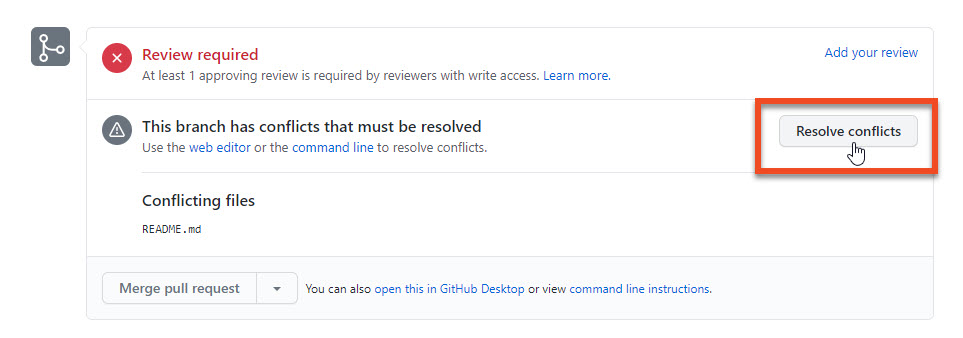
4. Edit the document to remove the conflicts and click **Mark as resolved**.
  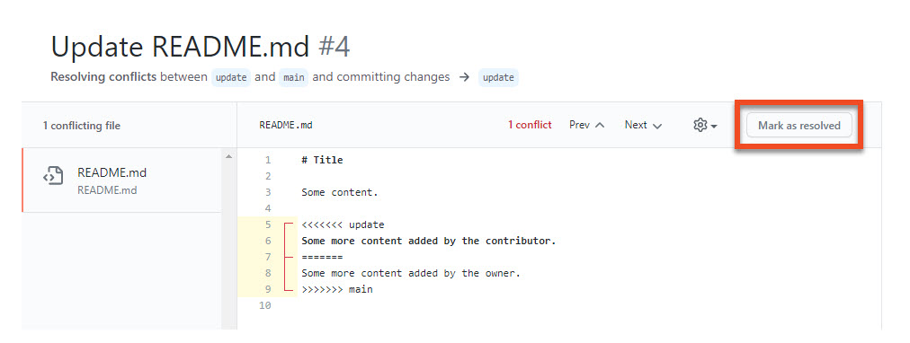
5. Click **Commit merge**.
