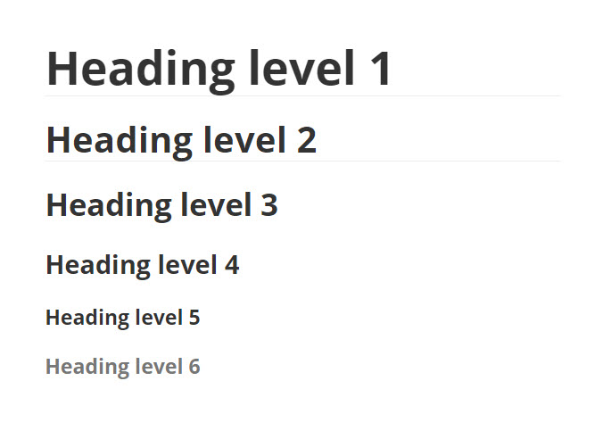

Basic Markdown syntax
=====================

[Markdown](https://daringfireball.net/projects/markdown/) is a lightweight markup language that lets you create formatted text using a plain-text editor. Here's an overview of the basic Markdown syntax.

## Title

To format a line of text as the document title, underline it with any number of = characters.

```
Document title
==============
```

#### Result:


## Headings

To create a heading, add one or more number signs (#) before a line of text.

```
# Heading level 1

## Heading level 2

### Heading level 3

#### Heading level 4

##### Heading level 5

###### Heading level 6
```

#### Result:



## Paragraphs

To create paragraphs, separate portions of text with a blank line.

```
Mrs. Dalloway said she would buy the flowers herself.

For Lucy had her work cut out for her.
```

#### Result:


## Line breaks

To add a line break, type two or more spaces at the end of the line and press `Enter`.

## Emphasis

You can add emphasis using asterisks or underscores.

### Bold

To bold a word or phrase, add two asterisks or underscores before and after the text.
```
This is some **bold text**.

This is some more __bold text__.
```

#### Result:


### Italic

To italicize a word or phrase, add one asterisk or underscore before and after the text.

```
This is some *italic text*.

This is some more _italic text_.
```

#### Result:


## Lists

You can create both ordered and unordered lists.

### Unordered lists

To create an unordered list, start each line with a dash (-), asterisk (*), or plus sign (+). You can create a nested list by indenting lines.

```
- First item
- Second item
- Third item

* First item
* Second item
* Third item

+ First item
+ Second item
+ Third item

- First item
- Second item
- Third item
    - Indented item
    - Indented item
```

#### Result:


### Ordered lists

To create an ordered list, start each line with a number followed by a period. You can create a nested list by indenting lines.

```
1. First item
2. Second item
3. Third item
4. Fourth item

1. First item
2. Second item
3. Third item
4. Fourth item
    4.1. Indented item
    4.2. Indented item
```

#### Result:


## Links

If you want to create a link, enclose the text to be displayed in square brackets and follow it immediately with the URL in round brackets.

```
[Example website](https://example.com)
```

#### Result:


## Images

To add an image, type an exclamation mark (!) and follow it by the alt text in square brackets and the image URL in round brackets.

```

```

#### Result:


## Blockquotes

To create a blockquote, start a paragraph with a > sign.

```
> What a lark! What a plunge!
```

#### Result:


## Tables

If you want to insert a table, add three or more dashes (-) to create column headers and use pipes (\|) to separate each column. Optionally, you can add pipes on either side of the table.

```
| Header | Header | Header |
| ------ | ------ | ------ |
| Item   | Item   | Item   |
| Item   | Item   | Item   |
| Item   | Item   | Item   |
```

#### Result:


## Inline code

To denote a portion of text as code, enclose it in backticks (`).

```
Type `git add .` in the command line.
```

#### Result:


## Code blocks

To create a code block, add three backticks (```) on the lines before and after the code block.

~~~
```
<div>
    <p>Hello world!</p>
</div>
```
~~~

#### Result:


## Resources

If you want to learn more about Markdown, here are some useful resources:

- [Short Markdown tutorial](https://commonmark.org/help/tutorial/index.html)
- [Markdown cheat sheet](https://guides.github.com/pdfs/markdown-cheatsheet-online.pdf)
- [Collection of Markdown tools](https://github.com/mundimark/awesome-markdown)