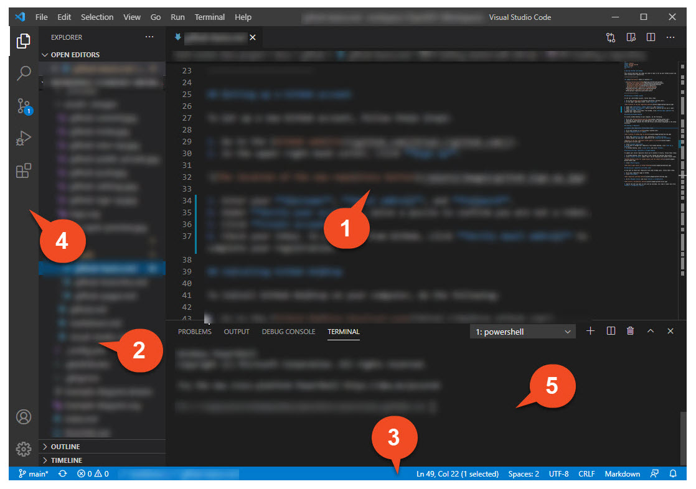
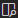
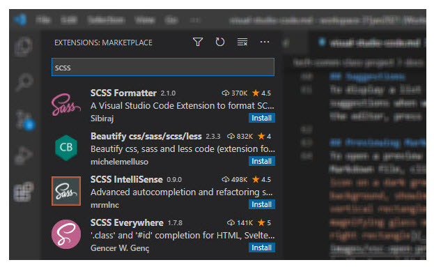

Visual Studio Code basics
=========================

**Visual Studio Code** is a lightweight source code editor available for Windows, macOS, and Linux. It's a useful tool for editing Markdown, HTML, and other documents.

## Setup

To install Visual Studio Code on your desktop computer, follow these steps:

1. Go to the [Visual Studio Code download page](https://code.visualstudio.com).
2. Download an installation file appropriate for your operating system.
3. Once downloaded, execute the file and follow the instructions displayed in the setup assistant.

## Basic layout

The Visual Studio Code user interface is divided into five areas.

1. **Editor**: the main area where you edit your files.
2. **Side bar**: an area containing different views such as the Explorer.
3. **Status bar**: information about the current project.
4. **Activity bar**: a set of icons that let you switch between views.
5. **Panels**: debug information, errors and warnings, an integrated terminal, etc.

For a detailed description of the respective areas, go to [Visual Studio Code documentation](https://code.visualstudio.com/docs/getstarted/userinterface).

## Searching for features

If you want to search for a particular Visual Studio Code feature, press `Ctrl+Shift+P` and start typing.

## Rendering whitespace
To display whitespace characters in the editor, go to **View > Render Whitespace**.

## Suggestions
When working in the editor, you can display a list of suggestions by pressing `Ctrl+Space`.

## Previewing Markdown files
To open a preview of your Markdown file, click  in the top right-hand corner of the editor.

## Document outline

To display an outline of your document, click **Outline** on the Side Panel.

## Installing extensions

Visual Studio Code lets you browse and install numerous extensions from within the program. To install a new extension, do the following:

1. Go to **View > Extensions**.
2. Start typing and choose an extension from the list.
  
3. Click **Install**.

## Markdown All in One

The **Markdown All in One** extension provides helpful features for working with Markdown-based documents.

### Setup

To install the **Markdown All in One** extension, follow these steps:
1. Go to **View > Extensions**.
2. Type "Markdown All in One" and choose the extension from the list.
3. Click **Install**.

### Formatting a document

If you want to quickly format your Markdown document using the **Markdown All in One** extension, press `Ctrl+Shift+P` and type "Format Document".

### Generating a table of contents

To generate a table of contents, do the following:
1. Go to the location in the document where you want to add the table of contents.
2. Press `Ctrl+Shift+P` and type "Create Table of Contents".

**Note:** If you make changes to your document structure and need to update the table of contents, press `Ctrl+Shift+P` and type "Update Table of Contents".